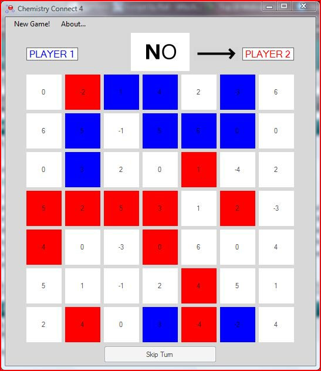

# ChemistryConnect4

ChemistryConnect4 was a two-player competitive game that I created to help myself learn and remember oxidation numbers whilst studying A-Level Chemistry at school.

## Screenshot Example

## Notes

I wrote ChemistryConnect4 quite a few years ago. It was written on Windows (and for Windows) at the time, but runs surprisingly well with Wine/Mono (5+ years later!). It even compiles out-of-the-box with MonoDevelop!

I am unlikely to continue developing this game, in C# at least.

I just thought that I would throw this up on GitHub so that I didn't forget about or lose it. Anyone is free to use and distribute it (under the terms of the MIT License) to help them or their friends learn and remember oxidation numbers! Don't use it to learn C# though (I had a lot to learn back then...)

Finally, I should note that Halcyon Digital Research was never a formal organisation or entity and is for all intents and purposes dead as a dodo. Therefore, the HDR link in the About menu now goes nowhere.
